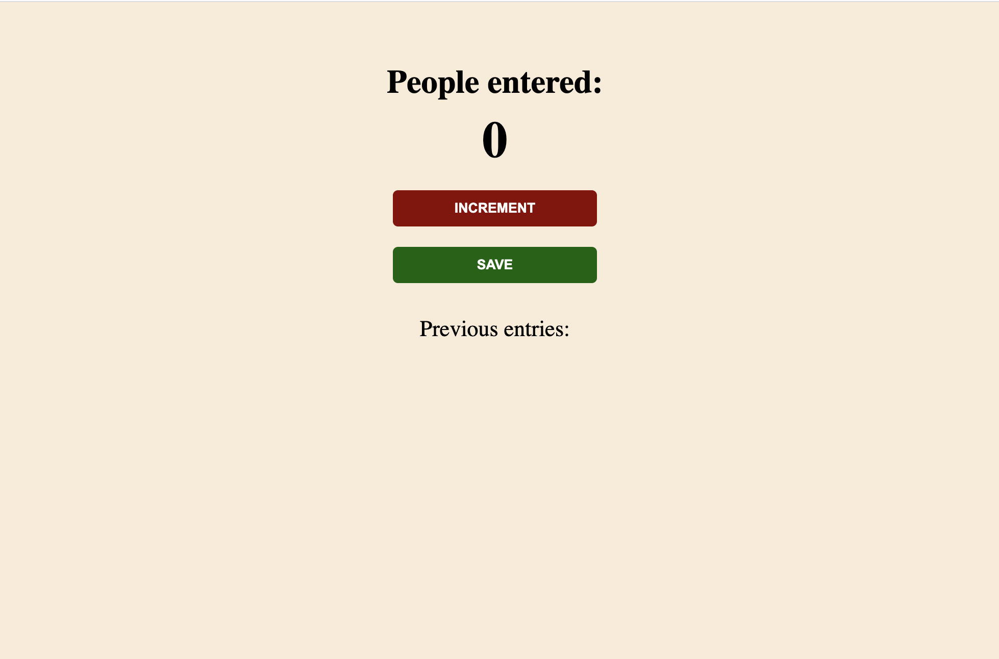

[![LinkedIn][linkedin-shield]][linkedin-url]

<!-- ABOUT THE PROJECT -->

## About

Follow freeCodeCamp.org


## Built With

- HTML
- CSS
- JavaScript

<!-- GETTING STARTED -->

## Installation

Clone the repo

```sh
git clone https://github.com/huongnguyen1709/passenger-counter
```

## Recap

- script tag
- variables
- numbers
- strings
- console.log()
- functions
- The DOM
- getElementById()
- innerText
- textContent

<!-- MARKDOWN LINKS & IMAGES -->
<!-- https://www.markdownguide.org/basic-syntax/#reference-style-links -->

[linkedin-shield]: https://img.shields.io/badge/-LinkedIn-black.svg?style=flat-square&logo=linkedin&colorB=555
[linkedin-url]: https://www.linkedin.com/in/huongnguyen1709/
